# **Emora by DCSION3**

**Team**: Hing Zi Feng, Lee Kai Shuen, Wong Soon Hong, Yong Zi Jing

**Problem Statement:** Stress & Workload Manager

**Video Presentation:** [https://youtu.be/coFNilHV4Vs](https://youtu.be/coFNilHV4Vs)

&nbsp;

**Presentation Slides:** [https://canva.link/99wq4808xd4f8ns](https://canva.link/99wq4808xd4f8ns)

&nbsp;

&nbsp;

1. ## **Project Overview**

Time management is becoming increasingly difficult. Students in particular are the hardest hit group. Their obligations cover not only academic work, but they also have to juggle between socialising, family members without sacrificing a sufficient amount of time for sports and wind-down time.&nbsp;

&nbsp;

To-do apps and calendars are what we consider bears the closest resemblance to what we are actually solving but both of them fall short in certain crucial aspects.

&nbsp;

| Application | Where do they fall short? | Emora’s proposition |
| :---- | :---- | :---- |
| To-do apps | Most to-do apps assumes that tasks especially academic related tasks are one-off and can be performed within one sitting with a clear cut duration, start and end date. The way it is designed to be used is tempting to cause students to overestimate the workload they are able to handle or underestimate the amount of time that needs to be scheduled in completing the said tasks. | We treat academic tasks as micro tasks that can be divided and spread out as long as its completion is done by the due date. Category needs to manually created and tedious logging People rely on it to keep track of what needs to be done tentatively in the future, but not what has been done, which makes comparison and keeping track of lifestyle difficult Fitness activities from Strava Sleep data from iOS, time when the alarm first engaged and time when the phone is no longer used serves as a very useful metrics in determining true sleep time |
| Calendars | Lacks context for public holidays or the anomalies whereby classes are cancelled, postponed or rescheduled to a later date. Doing so usually requires very meticulous planning. Academic calendars are known in advance, but rescheduling are hardly known weeks prior, usually only a week before the lesson starts.&nbsp; | Contextual understanding of Malaysian public holidays, ability to reschedule tasks easier |

&nbsp;

Our solution

We present Emora, a workload manager that is personalised and equipped with contextualised information. It is tailor-made to meet the needs of students who are handling not just academic obligations, but rather juggling between social and family responsibilities, without sacrificing their mental wellbeing.&nbsp;

&nbsp;

Feature sets

Comprehensive dashboard that shows the time spent on each category of activities covering 3 main groups namely (academic, personal and work).

&nbsp;

A timetable and schedule manager that integrates with students’ routine through Google Calendar synchronisation for their daily timetable or uploading the image of the timetable.&nbsp;

&nbsp;

Task manager that breaks down daunting assignments with tight deadlines, into manageable parts that is spread out across the free and easy time.&nbsp;

&nbsp;

Stress regulator is a mini game that mimics scientific-proven breathing sequence \- inhale to exhale duration ratio of 1:2. The user presses “space” for 8 seconds to inflate the balloon for three successful time.&nbsp;

&nbsp;

Integrated pop up chat assistant that is able to understand the user’s current emotion and change the site-wide theme to match the emotion

&nbsp;

2. ## **Ideation & Process**

   ### 2.1 Ideas we considered

&nbsp;

| Idea | Why it was dropped / kept |
| :---- | :---- |
| Google and Outlook Calendar synchronisation for the timetable and workload manager | Reduce redundant creating timetable and rely on existing source. |
| AI schedule importer that extracts user existing timetable from image, pdf, and etc. Then import it into timetable, user can also prompt to the ai using text and ai will understand then import the timetable according to user prompt | Make it easy for user to import timetable, without manually adding each of the activity into the timetable and let ai do the job |
| Scheduler that suggests allocation of time consuming tasks into manageable portions with drag-and-drop interactivity | An intuitive approach to visualise the time that can be spent |
| Emora ai buddy docked at the bottom of the viewport and expands when triggered with the ability to change site theme based on user’s current emotion, and also responds back to the user, based on what they been through by analysing the user today/this week timetable | Provide a sense of approachability and empathetic understanding to the user. |
| Ai assistant tab that will suggest user the best timetable schedule by approaching to user when detected adjustable timetable. User can also use the Ai assistant for general use such as changing timetable, adding schedule. And approach to ai assistant to seek for the low workload day and add more task or workshift to that day.&nbsp; | A general use of ai assistant that covered most of the important feature for user |
| Ai suggested timetable adjustment and rest time to help user balance their workload in everyday, to prevent user being overloaded | Help balancing user workload before they become overwhelmed |
| Health and fitness app synchronization (Strava) to fetch health related data&nbsp; | Provide historical data which are unlikely to be manually provided by the user to maintain accuracy in tracking the distribution of a person’s daily routine |
| Spotify integration to suggest music from user’s playlist or just ask for a song that the user thinks they want to listen. From there a playlist (radio)is generated. **(Dropped)** | Rely on workaround approaches rather than truly sanctioned official channels. Rate of failure is likely to be high |
| Face orientation and gesture controlled cat related meme generator to entertain or make user happy **(Dropped)** | Likely low universal suitability for all users&nbsp; |

&nbsp;

&nbsp;

### 

### 2.2 Ideation Boards

Link: [https://www.tldraw.com/f/xax6UxXrT-Q7Wuss3DEvC?d=v58975.-7024.25600.13307.page](https://www.tldraw.com/f/xax6UxXrT-Q7Wuss3DEvC?d=v58975.-7024.25600.13307.page)

&nbsp;

&nbsp;

### 

### 2.3 Mentor Consultation

&nbsp;

| Date | Mentor | Feedback received | What was changed |
| :---- | :---- | :---- | :---- |
| 10 September | Zach Khong&nbsp; | Visual clutterness in the overview tab resulting unintuitiveness in understanding the data presented | Reduced the tracked category from 5 to 3 Removed redundant and unnecessary charts. |
| 12 September&nbsp; | Janelle Tan | A distinct log only journal tab with waveform animation that matches the emotion and sentiment of the user text or dictation input might not necessarily be able to set itself apart from existing document or journal application. | Implemented a floating dock chat bubble that gets expanded when triggered and enables a site-wide theme change that matches with the user’s current emotion.&nbsp; |

&nbsp;

---

## 3. Design & Prototype

**UI Prototype:** [http://o7f8cifsp6c4ccztaw5ixzsm.149.118.132.238.sslip.io/](http://o7f8cifsp6c4ccztaw5ixzsm.149.118.132.238.sslip.io/)

### Interface Previews

| **Dashboard Overview** | **Interactive Timetable** |
| :---: | :---: |
| [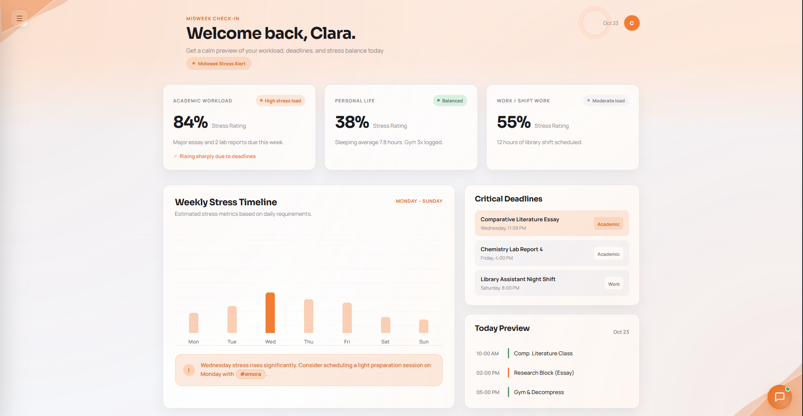](asset/home.png) | [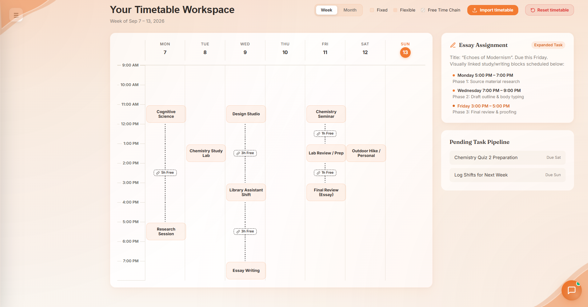](asset/timetable.png) |

| **Task Scheduler** | **AI Assistant** |
| :---: | :---: |
| [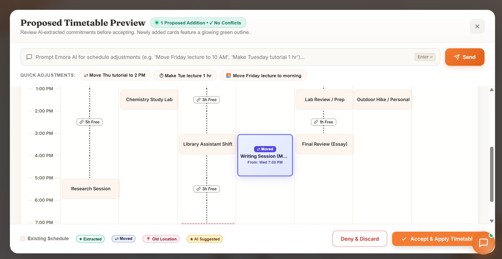](asset/scheduler.png) | [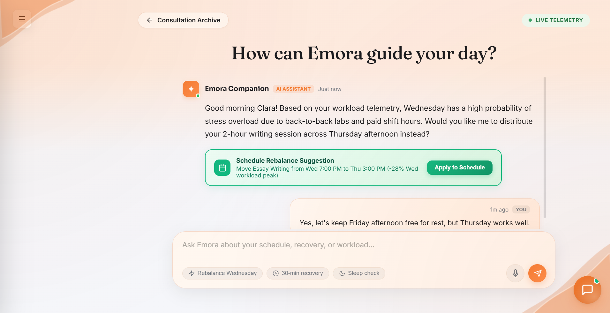](asset/assistant.png) |

| **Emotion Companion** | **Stress Regulation (Balloon Breathing)** |
| :---: | :---: |
| [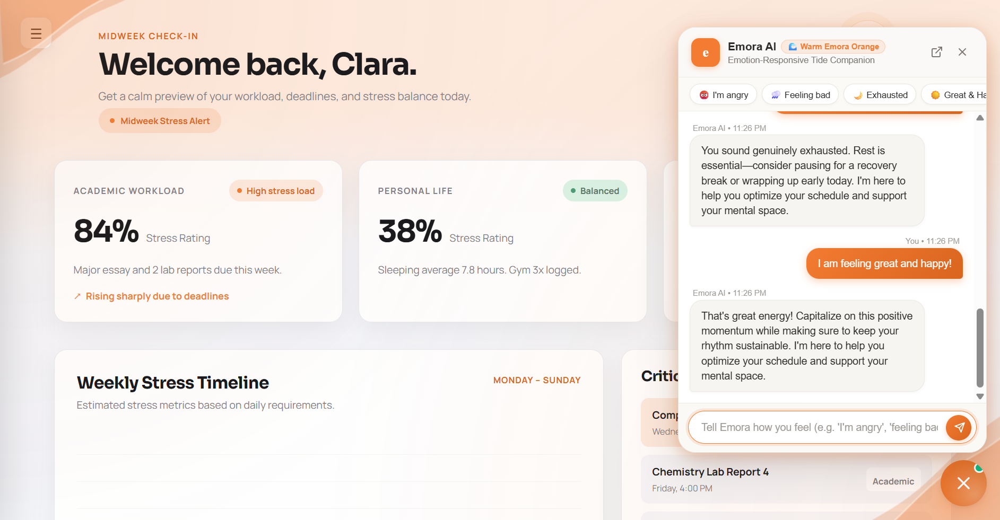](asset/emotion.png) | [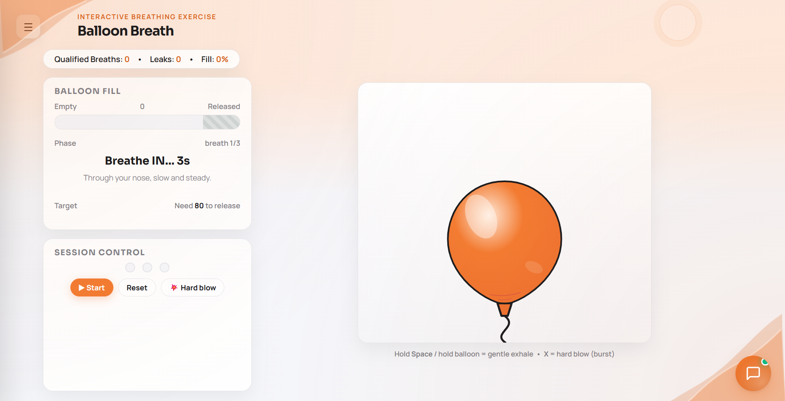](asset/balloon.png) |

| **Dark Mode & Ambient Theming** | **Account & Settings** |
| :---: | :---: |
| [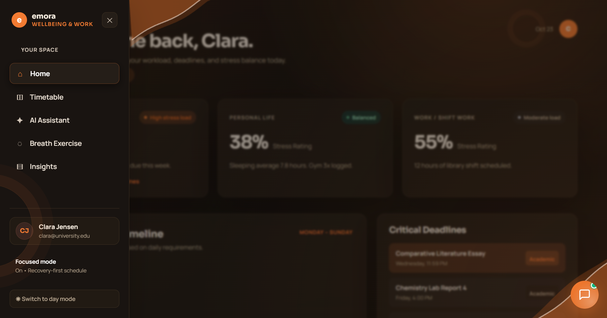](asset/dark.png) | [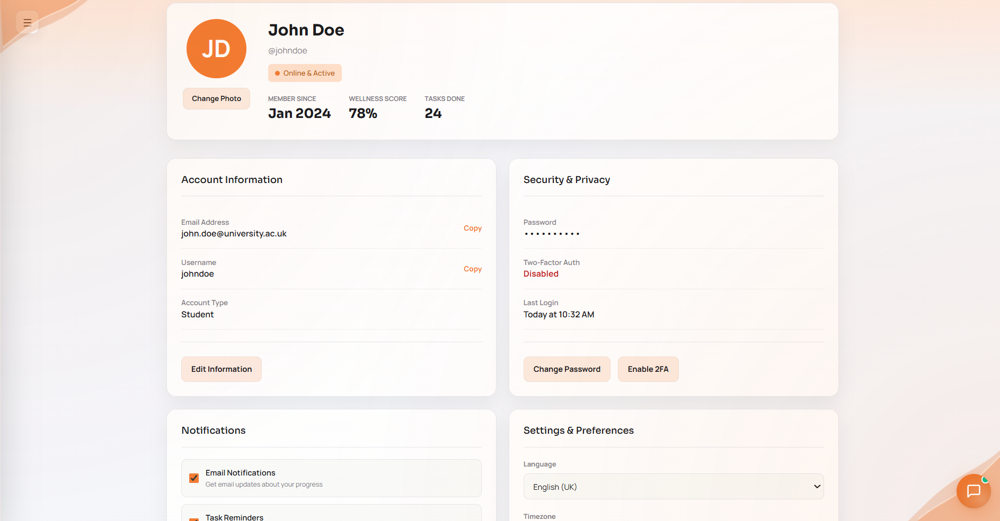](asset/account.png) |

---

## 4. What Makes It Different

   &nbsp;

| Existing solution | Our take&nbsp; |
| :---- | :---- |
| To-do list require users to mentally go through different timings and manually create&nbsp; | We used an LLM to infer the mental and cognitive load required for completing that particular task and suggest substeps to complete |
| Task scheduling requires a user’s due diligence and own initiative to choose and select which is an extremely tedious process | Timetable schedule for to-do list tasks with the ability to choose between more than one time and dynamically adjust the remaining available time for other tasks |
| Descriptive and generic advice on how to handle and tackle stress in the FAQ page | We used an interactive balloon breathing practice as a visual cue for inhalation and exhalation to regulate stress |

## 5. Technical Architecture & Feasibility

Emora employs a modern, decoupled client-server architecture designed for high responsiveness, cross-platform availability, and resilient AI capabilities with automated fallback handling.

---

### 5.1 System Architecture Diagram
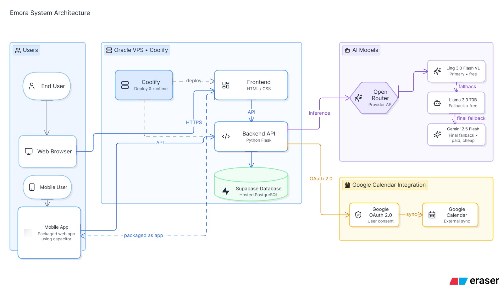
&nbsp;

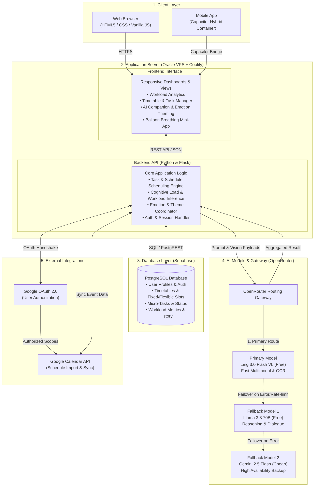

---

### 5.2 Core System Components

#### 1. Users & Presentation Layer
Emora is designed to be accessible across any device without platform disparity:
- **Web Browser**: Direct web access providing a lightweight, responsive desktop and mobile web experience.
- **Mobile Application**: Packaged natively from the web application using **Capacitor**, enabling seamless access on mobile devices with future support for widgets.
- **Unified Experience**: Both web and mobile applications connect to the same backend API, ensuring instant state and schedule synchronization across devices.

#### 2. Application Server (Oracle VPS + Coolify)
Hosted reliably on an **Oracle VPS** and orchestrated using **Coolify**.

- **Frontend (HTML5 / Vanilla CSS / JavaScript)**
  - Fast, dependency-free interface delivering smooth micro-animations.
  - Workload and burnout visualization indicators.
  - Interactive schedule manager and dynamic micro-task allocator.
  - Floating Emora AI companion with emotion-driven ambient theme shifting.
  - Balloon breathing regulation mini-game for guided stress relief.

- **Backend API (Python Flask)**
  - Centralized RESTful API handling core business and schedule logic.
  - Task splitting algorithms that break daunting assignments into micro-steps.
  - Cognitive and physical workload calculation engine (Academic, Work, Personal).
  - Database connectivity layer communicating with Supabase PostgreSQL.
  - Resilient AI proxy dispatching requests through OpenRouter.
  - Calendar integration bridge utilizing Google OAuth 2.0.

#### 3. Database Layer (Supabase PostgreSQL)
Persistent storage managed through **Supabase**, hosting a cloud PostgreSQL database storing:
- User accounts, authentication states, and personal settings.
- Timetable schedules (fixed classes/commitments vs. flexible study blocks).
- Micro-tasks, completion statuses, and deadlines.
- Real-time and historical workload scores to identify burnout trends.
- Application preferences and mood logs.

#### 4. AI Models & Failover Gateway (OpenRouter)
Rather than tightly coupling to a single model provider, Emora leverages **OpenRouter** with an automated multi-tier fallback architecture to guarantee uninterrupted availability:
- **Primary Model — Ling 3.0 Flash VL (`:free`)**: Used for primary schedule extraction, multimodal timetable OCR, and general task assistance at zero operating cost.
- **Fallback Model 1 — Llama 3.3 70B (`:free`)**: Automatically engaged if the primary model fails or experiences rate limits, providing robust reasoning and companion conversations.
- **Fallback Model 2 — Gemini 2.5 Flash (`:cheap`)**: Acts as a high-reliability tertiary fallback to guarantee 99.9% uptime for critical user flows.

#### 5. Google Calendar Integration
Enables bi-directional timetable synchronization without requiring repetitive manual schedule input:
- **Google OAuth 2.0**: Secure user-authorized access without sharing credentials.
- **Google Calendar API**: Imports lectures, meetings, and personal events directly into Emora's schedule manager.
- **Smart Categorization**: Extracted events are automatically mapped into Academic, Work, or Personal buckets for workload tracking.

---

### 5.3 System Data Flows

#### A. Standard User & Application Flow
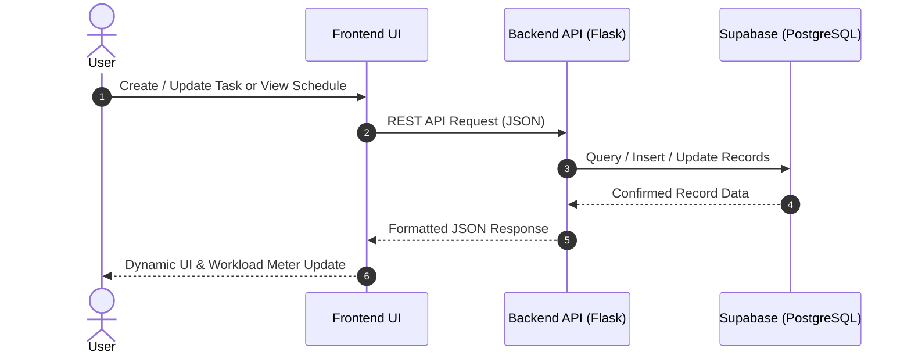

#### B. AI Request & Failover Routing
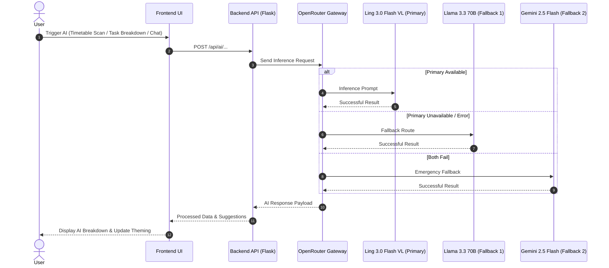

#### C. Google Calendar Synchronization
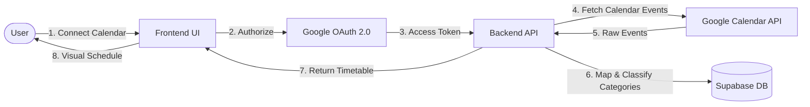

---

### 5.4 Deployment & Infrastructure Specifications

| Component | Technology / Service | Purpose |
| :--- | :--- | :--- |
| **Frontend** | HTML5, Vanilla CSS, JavaScript | Interactive, responsive user interface and dynamic theming |
| **Mobile Shell** | Capacitor | Packages web application into an installable mobile experience |
| **Backend API** | Python (Flask) | Business logic, scheduling algorithms, and service orchestration |
| **Hosting & Ops** | Oracle Cloud VPS + Coolify | Containerized hosting, SSL, and deployment automation |
| **Database** | Supabase (PostgreSQL) | Secure, managed relational database with persistent storage |
| **AI Gateway** | OpenRouter | Unified model API routing and automated multi-tier failover |
| **Primary AI** | Ling 3.0 Flash VL (`:free`) | Primary multimodal vision-language model for OCR and tasks |
| **AI Fallback 1** | Llama 3.3 70B (`:free`) | Secondary LLM fallback for conversational companion and reasoning |
| **AI Fallback 2** | Gemini 2.5 Flash (`:cheap`) | High-speed, high-availability tertiary safety net |
| **Authentication** | Google OAuth 2.0 | Secure authorization and granular calendar permission scopes |
| **Calendar Service** | Google Calendar API | External schedule synchronization and event extraction |

---

## 6. Build Plan & Scope

| Feature | Current State | Build Plan Requirements |
| :--- | :--- | :--- |
| **Database** | Database is empty. Nothing is currently written/read; pages reload to the same hardcoded data. | Connect all app data to the database. Replace hardcoded data with real CRUD operations and persistent user data. |
| **User Authentication** | Login and sign-up are not implemented. | Implement sign-up, login, logout, session management, and user profiles. |
| **Homepage Activity Percentage** | Activity categorization is incomplete, so workload percentages are not fully accurate. | Complete activity categorization rules and connect them to the Academic, Work, and Personal workload calculations. |
| **AI Assistant — User Preference** | AI can scan timetables and process user input, but does not proactively interact with the user. | Make the AI understand user preferences and proactively provide relevant suggestions based on their schedule and workload. |
| **Emora AI Companion** | Companion mainly collects the user's emotions but does not understand their actual schedule/workload. | Combine emotion, timetable, tasks, and workload data so the companion can understand the user's situation before responding. |
| **Interactive Timetable & Task List** | Timetable lacks detail and task-list navigation is flawed. | Improve timetable/task interactions, navigation, task details, editing, and Fixed/Non-Fixed schedule handling. |
| **Mobile UI & Home Screen Gadget** | Mobile UI and home-screen gadget have not been built. | Build responsive mobile UI and a mobile home-screen widget/gadget for quick workload updates and AI suggestions. |
| **Google Calendar API** | Calendar import works conceptually, but extracted activities are not categorized yet. | Categorize imported calendar activities automatically and map them into Emora's workload system. |
| **Outlook Calendar** | Not implemented. | Add Outlook Calendar integration and apply the same activity extraction and categorization system. |
| **AI Suggested Rest Time** | Not implemented. | Use workload, schedule gaps, and user preferences to recommend suitable rest/recovery periods. |
| **AI Calendar Adjustment** | Not implemented. | Detect overloaded days and suggest moving flexible tasks to lower-stress periods. |
